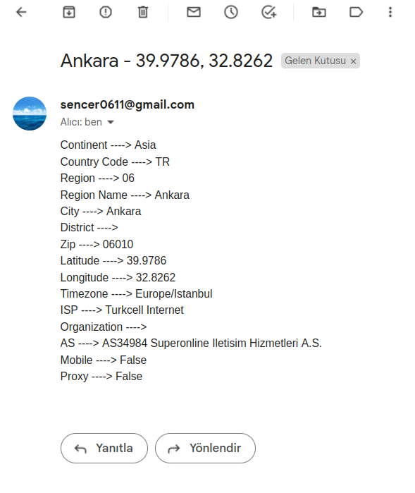
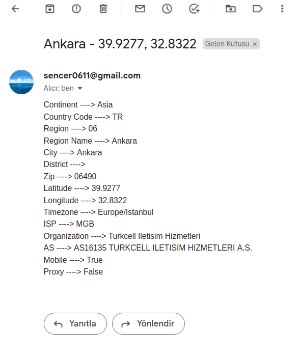

<h1 style="font-size: 48px" align="center">Location Fetcher and Mail Notifier for Nginx Web Servers</h1>


This tool has been designed and tested for Nginx Web Servers. However, it is possible to use it with other web servers like Apache with minor modifications.

<div style="display: flex; justify-content: center; align-items: center;">
  <a href="images/example1.png"></a>
    <a href="images/example2.png"></a>
</div>


<div style="display: flex; justify-content: center; align-items: center;">
  <a href="https://nginx.org/en/"></a>
  <a href="https://developers.google.com/gmail/api/quickstart/python"></a>
</div>


Welcome to the IP Location Finder project for Nginx Web Server! This tool is designed to fetch the location of the IP address that requests your Nginx web server. It is designed to work in conjunction with a specific regex pattern, and once a matching request is found, it extracts the client's IP address, fetches the location details, and sends this information via Gmail. This can be incredibly useful for various web applications and services to track the geographical origin of incoming requests.

Please note that this project is currently in development, and detailed documentation will be provided during the production phase. However, you are welcome to test the tool, and your feedback is highly appreciated. If you encounter any issues or have suggestions, please let us know!

## Table of Contents

- [Getting Started](#getting-started)
  - [Prerequisites](#prerequisites)
- [Installation - Configuration](#installation---configuration)
- [Usage](#usage)
  - [Dockerization](#dockerization)
- [Contributing](#contributing)
- [License](#license)

## Getting Started

### Prerequisites

Before using this tool, make sure you have the following prerequisites met:

1. ***A domain associated with your local server hosting an Nginx web server:*** You must have Nginx correctly installed and configured on your local server. You can refer to the [Installation - Configuration](#installation---configuration) section for detailed instructions.

2. ***requirements.txt***: Ensure that you have the necessary Python dependencies installed. Using pip:

   ```bash
   pip install -r requirements.txt
   ```

## Installation - Configuration

1. Clone the repository: 

    ```bash
    git clone https://github.com/senceryucel/nginx-ip-location-fetcher-sender.git
    ```
2. Navigate to the project directory:

    ```bash
    cd nginx-ip-location-fetcher-sender
    ```

3. Link the access.log file to the project directory (do not forget to replace the path with your own access.log file's path):

    ```bash
    ln -s /var/log/nginx/access.log access.log
    ```

4. Replace the token.json file with your own Gmail API token file. You can follow the instructions [here](https://developers.google.com/gmail/api/quickstart/python) to create your own token file.

5. Modify the configs.json file to match your own configuration. Below is a brief explanation of the fields:

    - ***general:*** This section contains general configurations for the tool. The wanted_country field is used to filter out requests from other countries. If you want to focus on a specific country, you can specify the country code here. The default value is "TR" (Turkey). You can refer to the [ISO 3166-1 alpha-2](https://en.wikipedia.org/wiki/ISO_3166-1_alpha-2) for more information. If you want to disable this feature, you can set the value to false:
      ```json
      "wanted_country": false
      ```
      If you specified a country code, you should also set the limit_to_send_mail field to the number of requests you want to receive from countries except the country you configured before sending an email. The default value is 50.


    - ***ip_fetcher:*** This section contains configurations for the IP address location fetcher. The generated_fields field is used to specify which fields to include in the email. For detailed information, you can refer to the [IP Geolocation API](https://ip-api.com/docs/api:json).

    - ***file_watcher:*** This section contains configurations for the file watcher. The request_regex field is used to specify the regex pattern to match requests in the access.log file. The pattern is designed to match requests with Nginx default log structure. You can modify the pattern to match your own log structure. For detailed information, you can refer to the [Nginx Log Format](https://nginx.org/en/docs/http/ngx_http_log_module.html#log_format).

    - ***gmail_sender:*** This section contains configurations for the Gmail sender. Do not forget to replace your wanted target mail address in mail_to field.  

6. Nginx Configuration: You need to configure your Nginx web server to log requests to the access.log file. Default Nginx log configuration is in the /etc/nginx/nginx.conf file. If you have modified your configuration before, you have to go back to the default configuration. Below is the default configuration:

    ```bash
    log_format combined '$remote_addr - $remote_user [$time_local] '
                    '"$request" $status $body_bytes_sent '
                    '"$http_referer" "$http_user_agent"';    
    ```
    
    If your Nginx server has an SSL certificate, you will need to log the client's IP instead of your SSL provider's IP. You can do this by changing $remote_addr to $http_x_forwarded_for in the log_format configuration. Below is an example of the modified configuration:

    ```bash
    log_format combined '$http_x_forwarded_for - $remote_user [$time_local] '
                    '"$request" $status $body_bytes_sent '
                    '"$http_referer" "$http_user_agent"';
    ```

## Usage

If you have followed the instructions in the [Installation - Configuration](#installation---configuration) section, you can start the tool:
```bash
python3 app.py
```

### Dockerization

You can containerize the tool if you wish. Go into the project directory and build the image:
```bash
docker-compose build
```

Then you can run the container:
```bash
docker-compose up
``` 

## Contributing

Contributions are always welcome! Please feel free to open an issue or a pull request.

## License

This project is licensed with GNU GENERAL PUBLIC LICENSE. For more information, please refer to the [LICENSE](LICENSE) file.

<br><br>

***
###### Sencer Yucel, 2023
